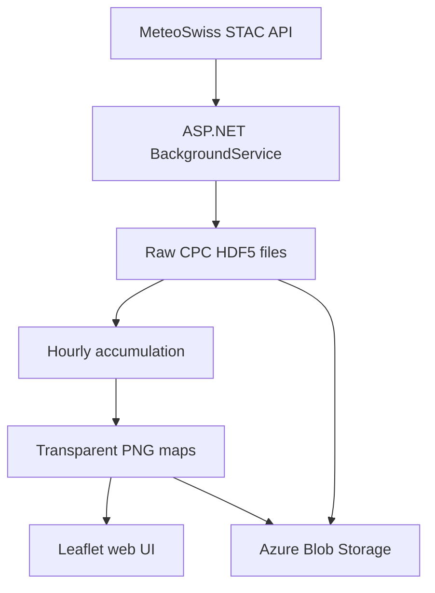

# Swiss Rain Radar

A modern, public rain-accumulation map for Switzerland built with ASP.NET Core 10, Leaflet, MeteoSwiss Open Data, Azure App Service, Blob Storage, Terraform, and GitHub Actions.

The first version provides zooming and panning plus selectable 1, 3, 6, 12, and 24-hour precipitation totals. It intentionally contains no GPS or browser geolocation functionality.

## Architecture



The web process checks the MeteoSwiss STAC collection every five minutes while the App Service process is running. It saves source files in the private `raw` container, renders maps into the private `maps` container, and serves images through the public ASP.NET API.

Each CPC file contains the precipitation total for the preceding 60 minutes. Longer periods use files exactly one hour apart, preventing the over-counting that would occur if every overlapping five-minute publication were summed.

## Repository layout

| Path | Purpose |
|---|---|
| `src/SwissRainRadar.Web` | ASP.NET web app, updater, HDF5 processing and frontend |
| `tests/SwissRainRadar.Tests` | Unit tests for parsing, aggregation, projection and colors |
| `infra/bootstrap` | One-time Azure state storage and GitHub OIDC identity |
| `infra/main` | App Service, Blob Storage, monitoring, RBAC and retention |
| `.github/workflows` | CI and Azure deployment |
| `docs` | Architecture, implementation, local-development and testing documentation |

## Documentation

The [documentation overview](docs/README.md) links the detailed guides:

- [How the application works](docs/how-it-works.md)
- [Local development](docs/local-development.md)
- [Testing strategy](docs/testing.md)
- [Architecture decisions](docs/architecture.md)
- [Source-site analysis](docs/source-site-analysis.md)

## Run locally

Requirements:

- .NET SDK 10
- Node.js 24 and npm

```bash
npm ci
npm run vendor
dotnet restore SwissRainRadar.slnx
dotnet test SwissRainRadar.slnx
dotnet run --project src/SwissRainRadar.Web
```

Without `Storage__AccountUri`, files are written under `src/SwissRainRadar.Web/App_Data`. The first map normally appears after the app downloads and processes the required CPC files.

## Deploy to Azure

### 1. Bootstrap OIDC and Terraform state

Sign in locally with an Azure account that can create resource groups, identities and role assignments, then run:

```bash
cd infra/bootstrap
cp terraform.tfvars.example terraform.tfvars
# Set subscription_id in terraform.tfvars.
terraform init
terraform apply
terraform output
```

The bootstrap deliberately uses local Terraform state. Secure this state because it records Azure resource identifiers, then retain it for later bootstrap changes.

### 2. Configure GitHub environment variables

Create a GitHub environment named `production` and add these repository or environment variables from the bootstrap outputs:

| GitHub variable | Terraform output |
|---|---|
| `AZURE_CLIENT_ID` | `azure_client_id` |
| `AZURE_TENANT_ID` | `azure_tenant_id` |
| `AZURE_SUBSCRIPTION_ID` | `azure_subscription_id` |
| `TFSTATE_RESOURCE_GROUP` | `tfstate_resource_group` |
| `TFSTATE_STORAGE_ACCOUNT` | `tfstate_storage_account` |
| `TFSTATE_CONTAINER` | `tfstate_container` |

No Azure client secret or publish profile is required. The deployment workflow exchanges GitHub's OIDC token for a short-lived Azure token.

### 3. Deploy

Run the `Deploy Azure` GitHub Actions workflow or push an application or infrastructure change to `main`. The workflow applies Terraform, tests and publishes the app, deploys the ZIP package, and verifies `/healthz`.

## Azure behavior and cost choices

The App Service Plan uses one Linux B1 instance and `always_on = false`. Therefore background processing may stop after the site becomes idle; the next public request wakes the application and it catches up before publishing a new map, matching the initial requirement that updates only run while the website is active.

On a new installation, the latest map is prioritized and the optional background backfill then downloads up to 14 days of CPC source files. MeteoSwiss documents each HDF5 file as smaller than 1 MB, so the theoretical upper bound is several gigabytes plus request costs; set `Radar__BackfillOnStartup=false` if this is not wanted.

Blob lifecycle rules delete source data after 14 days and historical generated maps after 15 days. Azure lifecycle execution is asynchronous, so deletion is not guaranteed at the exact minute an object reaches that age.

## Security notes

- App Service accesses Blob Storage with its system-assigned Managed Identity.
- Storage shared-key authorization and anonymous container access are disabled.
- GitHub Actions uses OIDC and explicitly limited workflow permissions.
- The deployment identity receives `Contributor` and `Role Based Access Control Administrator` only on the application resource group; the latter is needed because Terraform creates the web app's storage RBAC assignment.
- Terraform state and `*.tfvars` are excluded from Git.
- Browser GPS, camera and microphone permissions are disabled by response policy.
- Dependabot monitors NuGet, npm, Terraform providers and GitHub Actions.

## Data and attribution

Radar data comes from the MeteoSwiss `ch.meteoschweiz.ogd-radar-precip` STAC collection. Reuse must comply with the current MeteoSwiss terms, including their rules for attribution of unaltered data and clear separation of independently processed output from official MeteoSwiss products. The UI identifies the CombiPrecip data basis, and the application is presented as an independent visualization rather than an official weather warning.

The base map uses OpenStreetMap tiles and displays the required contributor attribution. Review usage limits before operating a high-traffic public service; a production version can be switched to a suitable Swiss federal or commercial tile service.

This project is independent and is not affiliated with meteoradar.ch, Meteotest AG, MeteoSwiss, or OpenStreetMap.

## Known first-version limitations

- Only the newest period end is displayed; historical source data are stored but no history selector is exposed.
- The app is designed for one App Service instance. Before scaling out, add a distributed lease so only one worker performs imports.
- The rendering covers the MeteoSwiss radar rectangle around Switzerland rather than masking every pixel exactly to the national border.
- Forecasts, GPS, alerts and station-value labels are outside version 1.

## License

Application source code is available under the MIT License. MeteoSwiss and map data retain their respective terms and attribution requirements.
