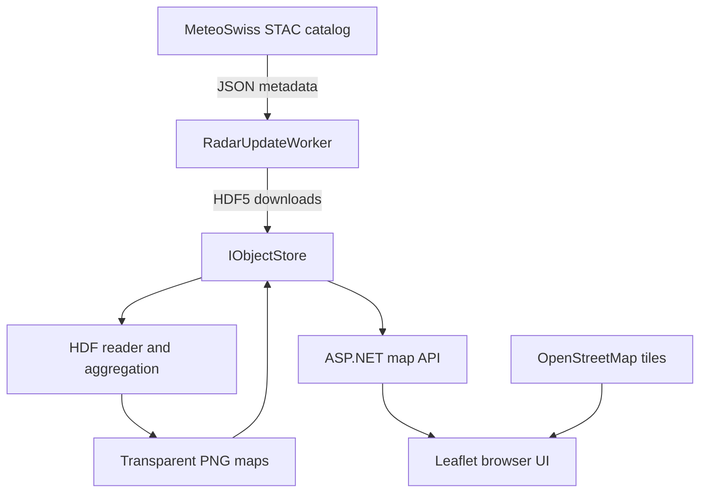

# How the application works

## System overview

Swiss Rain Radar is one ASP.NET Core application with two responsibilities:

1. A hosted background worker discovers and processes MeteoSwiss radar data.
2. The web application serves the static frontend and the generated rain maps through HTTP endpoints.



No separate Node.js server, scheduler, Azure Function or frontend hosting service is required at runtime.

## MeteoSwiss data source

### Access and terms

The application uses the public MeteoSwiss Open Data collection `ch.meteoschweiz.ogd-radar-precip`. Access does not require an account, API key or paid subscription. Consumers must still respect the applicable MeteoSwiss terms, avoid excessive repeated downloads and ensure that an independently processed visualization is not presented as an official MeteoSwiss product.

The application identifies its HTTP client with a project-specific user agent and caches downloaded source files to avoid downloading the same asset repeatedly.

### What STAC means

STAC stands for **SpatioTemporal Asset Catalog**. STAC describes data assets by location and time. It is the catalog used to discover radar files; it is not the radar file format itself.

The configured catalog endpoint is:

```text
https://data.geo.admin.ch/api/stac/v1/collections/ch.meteoschweiz.ogd-radar-precip/items
```

`MeteoSwissClient` requests daily STAC items. The response is JSON metadata containing timestamps, media types and download URLs for the actual data files.

### HDF5 radar assets

The actual CombiPrecip data is downloaded as binary HDF5 (`.h5`) files. The current reader opens the precipitation grid at:

```text
/dataset1/data1/data
```

The sample used during implementation contained a 710 by 640 grid with one-kilometre cells in the Swiss LV95 coordinate system. The values represent precipitation in millimetres for a 60-minute accumulation window.

`HdfRadarReader` temporarily materializes the incoming stream as a file because the managed HDF library requires file access. The temporary file exists only during parsing and is deleted afterward. The persistent source copy remains in the configured object store.

## Background updates

### Hosted service instead of cron

`RadarUpdateWorker` derives from ASP.NET Core `BackgroundService` and is registered in `Program.cs`:

```csharp
builder.Services.AddHostedService<RadarUpdateWorker>();
```

It is not a cron job and does not run at fixed wall-clock times such as 12:00, 12:05 and 12:10. It starts with the ASP.NET process, runs an update immediately, and then waits on a `PeriodicTimer`:

```csharp
using var timer = new PeriodicTimer(_interval);
while (await timer.WaitForNextTickAsync(stoppingToken))
{
    await RunUpdateAsync(stoppingToken);
}
```

The default interval is configured in `appsettings.json`:

```json
{
  "Radar": {
    "UpdateIntervalMinutes": 5,
    "RawRetentionDays": 2,
    "BackfillOnStartup": true,
    "FixedReferenceTimeUtc": null,
    "RunOnceWhenReferenceTimeIsFixed": true,
    "PeriodsHours": [1, 3, 6, 12, 24]
  }
}
```

Configuration validation prevents intervals shorter than five minutes.

### Reproducible fixed-time mode

`RadarUpdateCoordinator` receives .NET's `TimeProvider` instead of reading the system clock directly. Normally `Program.cs` registers `TimeProvider.System`. When `Radar:FixedReferenceTimeUtc` contains a UTC timestamp, it registers `FixedTimeProvider` instead.

The service captures that time once at the start of an update and uses it consistently to:

1. Choose the STAC calendar days to query.
2. Reject assets whose timestamp is later than the reference time.
3. Select the latest eligible accumulation period.
4. Set the manifest's `updatedAt` value.

With `RunOnceWhenReferenceTimeIsFixed=true`, the worker completes the immediate update (and an enabled backfill) and then exits without creating its periodic timer. Restarts therefore select the same source files and reuse them from storage. STAC metadata is still queried on each start; a fixed timestamp is not a permanent external-data archive.

The committed Development settings fix the time at `2026-08-31T06:30:00Z` and disable startup backfill. The production default remains `null`, so Azure continues to use current UTC time and five-minute polling.

### Polling is not always downloading

Every update checks the STAC catalog, but it does not necessarily download a new HDF5 file. `RawRadarFileImporter.DownloadRawRadarFilesAsync` first checks whether each file already exists in `IObjectStore`. Only missing files are downloaded.

The application currently uses hourly CombiPrecip windows. Polling every five minutes lets it notice a newly published product promptly, while persistent storage prevents repeated downloads of an already imported product.

### Update sequence

`RadarUpdateCoordinator.UpdateLatestAsync` coordinates the following work:

1. Query STAC items for the reference day and preceding day.
2. Exclude assets later than the reference time and select the newest eligible CombiPrecip asset.
3. Select up to 24 assets exactly one hour apart.
4. Download only assets that are not already stored.
5. Read each binary HDF5 precipitation grid.
6. Sum the first 1, 3, 6, 12 or 24 hourly grids.
7. Render each available total as a transparent PNG.
8. Store the timestamped maps.
9. Replace `maps/latest.json` with a manifest for the browser.

When at least one map variant was generated, `MapTimelineFileProcessor` rebuilds `maps/timeline.json` from the retained PNG inventory. The timeline contains only prepared PNG variants, is ordered by period end and retains the configured number of days (`Radar:TimelineRetentionDays`, default 14). It does not trigger historical processing or list Blob objects on each browser request.

The source CPC products are rolling 60-minute totals published more frequently than once per hour. Summing every publication would count the same rain repeatedly, so `SelectNonOverlappingHours` deliberately chooses files one hour apart.

### Startup backfill

When `Radar:BackfillOnStartup` is enabled, an additional background task checks all STAC assets in the 14-day retention window after the first current-map update. Existing files are skipped. This can transfer many files on a new installation, so local development can disable it.

### Errors, shutdown and concurrency

Update failures are logged and do not stop the public web application. A previously published map remains available. ASP.NET passes a cancellation token to downloads and storage operations so shutdown can stop the worker cleanly.

Within one worker, periodic current-map updates do not overlap. The startup backfill is intentionally asynchronous and can run alongside a later update. Version 1 uses one App Service instance. If the application is scaled to multiple instances, every instance starts its own worker; a Blob lease or separate singleton importer must be added before scale-out.

### App Service sleep behavior

Terraform sets `always_on = false`. The worker therefore runs only while the ASP.NET process is alive. An idle App Service may be suspended, in which case no timer ticks occur. A later web request wakes the application and causes an immediate update during startup. Missed timer executions are not replayed individually.

## Storage abstraction

Application services depend on `IObjectStore`, not directly on the file system or Azure SDK. At startup, `Program.cs` selects an implementation based on `Storage:AccountUri`:

```csharp
if (string.IsNullOrWhiteSpace(storageAccountUri))
{
    builder.Services.AddSingleton<IObjectStore, FileObjectStore>();
}
else
{
    builder.Services.AddSingleton<IObjectStore, BlobObjectStore>();
}
```

The switch is configuration-based; it does not explicitly test whether the ASP.NET environment is Development or Production.

### Local file storage

With an empty `Storage:AccountUri`, `FileObjectStore` writes beneath `Storage:LocalRoot`, which defaults to `App_Data`:

```text
App_Data/
├── raw/
│   └── yyyy/MM/dd/<MeteoSwiss asset>.h5
└── maps/
    ├── history/yyyyMMddHHmm/1h.png
    ├── history/yyyyMMddHHmm/3h.png
    ├── history/yyyyMMddHHmm/6h.png
    ├── history/yyyyMMddHHmm/12h.png
    ├── history/yyyyMMddHHmm/24h.png
    └── latest.json
```

The exact local root is resolved relative to the application's content root.

### Azure Blob Storage

Terraform supplies an environment variable similar to:

```text
Storage__AccountUri=https://<account>.blob.core.windows.net
```

ASP.NET configuration maps the double underscore to `Storage:AccountUri`. This activates `BlobObjectStore`, which uses `DefaultAzureCredential`. In App Service, the credential resolves to the system-assigned Managed Identity. Terraform grants that identity `Storage Blob Data Contributor`.

Two private containers are used:

| Container | Contents |
|---|---|
| `raw` | Original MeteoSwiss HDF5 files |
| `maps` | Generated PNG files and `latest.json` |

Shared-key authorization and anonymous container access are disabled. Azure lifecycle rules remove raw data after 14 days and generated history after the configured retention period.

If `Storage:AccountUri` is accidentally missing in Azure, the application falls back to local `App_Data`. That fallback is convenient for development but should not be treated as the durable production archive.

## Web application

### Static frontend

The same ASP.NET application serves the website. It is a static HTML, CSS and JavaScript frontend rather than Razor Pages or server-rendered views:

```text
src/SwissRainRadar.Web/wwwroot/
├── index.html
├── css/site.css
├── js/app.js
└── vendor/leaflet/
```

`Program.cs` enables default files, static files and a single-page fallback:

```csharp
app.UseDefaultFiles();
app.UseStaticFiles();
app.MapFallbackToFile("index.html");
```

The `wwwroot` files are included in the ASP.NET publish output and deployed with the application. They are not stored in Blob Storage.

### HTTP endpoints

| Endpoint | Purpose |
|---|---|
| `GET /` | Static application shell |
| `GET /healthz` | Process health response |
| `GET /api/maps/latest` | Current JSON manifest or HTTP 503 before the first map exists |
| `GET /api/maps/timeline` | Ordered catalog of already prepared historical maps |
| `GET /api/maps/{timestamp}/{hours}` | A generated PNG read from the active object store |

Raw HDF5 files are never exposed by a public endpoint. Map containers remain private; ASP.NET validates the timestamp and supported period before streaming an image.

## Leaflet and the browser map

### What Leaflet provides

Leaflet is a client-side JavaScript mapping library. It manages the map viewport, geographic coordinates, zooming, panning, layers, controls and browser interaction. It does not download MeteoSwiss data, parse HDF5, calculate rain totals or run a server.

The visible map is composed from two principal layers:

1. OpenStreetMap background tiles loaded directly by the browser.
2. A transparent rain PNG exposed by the ASP.NET map API and positioned with a Leaflet `ImageOverlay`.

The server manifest supplies the geographic bounds. Leaflet stretches the transparent image over those bounds and keeps it aligned while the user zooms or pans. Switching between 1, 3, 6, 12 and 24 hours replaces the image overlay without resetting the viewport.

The timeline below the map displays the selected catalog timestamp. Previous and next buttons move directly between prepared snapshots, so a timestamp absent from `timeline.json` cannot be selected.

MeteoSwiss source grids use LV95. `RadarImageRenderer` converts regular output pixels between WGS84 and LV95 while rendering. Leaflet receives ordinary latitude and longitude bounds and handles its browser-map projection internally.

The application intentionally disables browser geolocation and contains no GPS feature.

### What is loaded from where

| Asset | Loaded from | Executed or rendered by |
|---|---|---|
| HTML, CSS and application JavaScript | ASP.NET `wwwroot` | Browser |
| Leaflet JavaScript and CSS | ASP.NET `wwwroot/vendor` | Browser |
| Rain PNG | ASP.NET map API | Browser through Leaflet |
| Base-map tiles | OpenStreetMap tile servers | Browser through Leaflet |
| HDF5 radar source | MeteoSwiss | ASP.NET background worker |

Leaflet is local to the deployment, but the base map still requires network access to the configured OpenStreetMap tile service.

## Client dependency build

### `package.json`

The root `package.json` declares Leaflet 1.9.4 and a custom npm script:

```json
{
  "scripts": {
    "vendor": "node scripts/vendor-assets.mjs"
  },
  "dependencies": {
    "leaflet": "1.9.4"
  }
}
```

`package.json` is not itself executed. `npm run vendor` looks up the `scripts.vendor` value and invokes:

```text
node scripts/vendor-assets.mjs
```

The name `vendor` is a project-defined script name, not a special npm keyword.

### `npm ci` versus `npm run vendor`

`npm ci` performs a clean, reproducible installation using `package-lock.json` and places Leaflet in `node_modules/leaflet`. `npm run vendor` does not download anything. It copies the already installed browser distribution:

```text
node_modules/leaflet/dist/
    → src/SwissRainRadar.Web/wwwroot/vendor/leaflet/
```

The `.mjs` extension marks the copy script as an ECMAScript module. It uses the built-in promise-based `mkdir` and `cp` functions, creates the target directory if needed and overwrites outdated copies.

Generated vendor files and `node_modules` are excluded from Git. GitHub Actions runs `npm ci` and `npm run vendor` before the .NET build. Node.js is therefore a build-time dependency, not a production runtime. The deployed App Service runs only ASP.NET and serves the copied files as static content.
