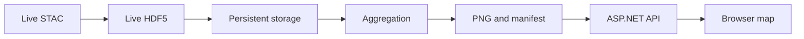

# Testing strategy

## Current status

The project has a successful .NET 10 build, automated unit tests and a limited manual runtime smoke test. It has not yet completed a full real-data browser or Azure end-to-end verification.

| Level | Present | Current coverage |
|---|---:|---|
| Compilation | Yes | ASP.NET application and test assembly build with .NET 10 |
| Unit tests | Yes | Parsing, selection, aggregation, colors, projection and PNG structure |
| Manual smoke test | Partial | Process startup, static page, health endpoint, unavailable-source handling and pre-map HTTP 503 |
| Component/integration tests | No | Real HDF5 fixture, object stores and ASP.NET endpoint behavior |
| Browser end-to-end tests | No | Full UI, period switching, zooming, panning and visual alignment |
| Azure end-to-end tests | No | Managed Identity, Blob Storage, App Service sleep/wake and lifecycle behavior |

This distinction is intentional: a successful build and unit-test run proves that isolated logic behaves as specified, but does not prove that a real MeteoSwiss asset becomes a geographically correct map in a browser.

## Existing automated unit tests

The tests in `tests/SwissRainRadar.Tests` are isolated tests. They do not start the complete ASP.NET application and do not call MeteoSwiss or Azure.

### `MeteoSwissClientTests`

- Parses a timestamp from a supported CPC file name.
- Rejects unrelated or malformed file names.

### `RadarUpdateServiceTests`

- Selects one non-overlapping radar product per hour.
- Stops selection at a data gap instead of silently inventing a complete period.
- Excludes catalog assets later than a fixed reference time and keeps eligible assets ordered.
- Removes expired timeline entries and replaces duplicate prepared-map timestamps.

### `FixedTimeProviderTests`

- Returns the configured instant consistently and normalizes it to UTC.

### `RainfallAggregatorTests`

- Adds every source-grid cell without mutating input grids.
- Rejects grids with incompatible dimensions.

### `RadarColorScaleTests`

- Keeps dry cells transparent.
- Maps a heavy-rain value to the expected color class.

### `SwissProjectionTests`

- Checks the WGS84-to-LV95 approximation against a Bern reference point.

### `PngEncoderTests`

- Verifies the generated PNG signature and final `IEND` chunk.

Run all tests with:

```bash
dotnet test SwissRainRadar.slnx --configuration Release
```

## Deterministic local test mode

`appsettings.Development.json` fixes the reference time at `2026-08-31T06:30:00Z`, disables the broad startup backfill and makes the worker run once. Repeated application starts therefore select the same period and reuse files already present under `App_Data`.

For a repeatable manual check:

1. Preserve `src/SwissRainRadar.Web/App_Data` between runs.
2. Start the application and record the manifest returned by `/api/maps/latest`.
3. Stop and restart the application.
4. Confirm that `periodEnd`, map URLs and files are unchanged.
5. Confirm that the log says periodic updates are disabled and no cached HDF5 file is downloaded again.

This mode controls application time and asset selection, but it does not make the external STAC catalog permanent. Once the chosen date is no longer published, a new checkout needs preserved fixtures/cache or a newer fixed timestamp.

## Manual smoke test already performed

The application was started as a real ASP.NET process with an intentionally unreachable MeteoSwiss URL. The following behavior was observed:

- The process started successfully.
- `/healthz` returned a healthy JSON response.
- `/` returned the static Swiss Rain Radar page.
- The background-source failure was caught and logged.
- The worker failure did not stop the web server.
- `/api/maps/latest` returned HTTP 503 before a map existed.

A current real MeteoSwiss HDF5 sample was also inspected independently to confirm the expected dataset path, dimensions and hourly accumulation semantics. That inspection was not connected to a complete HTTP-to-browser application run.

The correct name for this work is a **manual smoke test with partial integration**, not a full end-to-end test.

## What remains unverified

The following behavior still requires evidence:

- Live STAC discovery through the complete application.
- Download and persistent caching of up to 24 real hourly HDF5 files.
- PureHDF parsing of every relevant current product variant.
- Correct accumulation values for all configured periods.
- Correct LV95-to-WGS84 placement, orientation and visual alignment.
- PNG transparency and color-class behavior with real source values.
- Browser loading of every period while retaining map position.
- Azure Managed Identity authentication to Blob Storage.
- Container, RBAC and lifecycle behavior after Terraform deployment.
- App Service suspension, wake-up and immediate-update behavior.

## Proposed component and integration tests

### Real HDF5 fixture test

Store a small, redistribution-compatible test fixture or generate a deterministic HDF5 fixture during testing. Verify:

```text
HDF5 fixture
→ HdfRadarReader
→ RadarGrid dimensions and known values
```

This catches incompatibilities that array-only unit tests cannot detect.

Before committing a real MeteoSwiss file, confirm that redistribution of that exact or modified fixture complies with the applicable data terms. A generated fixture is safer when technically practical.

### Full processing-pipeline test

Use a fake `MeteoSwissClient` response and temporary `FileObjectStore`:

```text
Known source grids
→ RadarUpdateService
→ timestamped PNG files
→ latest.json
```

Assert manifest periods, storage paths, aggregation values and image dimensions.

### ASP.NET endpoint tests

Use `WebApplicationFactory<Program>` with a temporary object store to verify:

- Health response.
- HTTP 503 when `latest.json` is absent.
- JSON content type and manifest body when it exists.
- HTTP 400 for malformed timestamps and unsupported periods.
- HTTP 404 for a missing image.
- PNG streaming for a valid stored image.
- Security response headers.

These are integration tests because they start the ASP.NET request pipeline, dependency injection and routing.

### Object-store contract tests

Run the same behavioral test suite against `FileObjectStore` and, in an Azure-enabled test environment, `BlobObjectStore`. Cover put, existence, text read, binary read, replacement and cancellation behavior.

## Proposed browser end-to-end tests

Playwright can start the published application with deterministic prepared map files and then verify:

1. The page initializes without JavaScript errors.
2. Leaflet and the base layer are present.
3. The default rain overlay is displayed.
4. Every period selector changes the requested map URL.
5. The active period state is accessible and visible.
6. Zooming and panning change the viewport.
7. Switching periods does not reset the viewport.
8. A missing initial manifest produces a useful status message.
9. The layout remains usable on a mobile viewport.

These deterministic UI tests should not depend on the live MeteoSwiss or OpenStreetMap services. A separate, explicitly scheduled live-data test can cover those external dependencies without making every pull request flaky.

## Proposed live-data acceptance test

A manual or scheduled acceptance test should exercise the complete chain:



Acceptance criteria should include:

- A current manifest is published.
- All available configured periods return valid PNG files.
- The overlay is not mirrored, inverted or visibly shifted.
- Plausible rainfall locations agree with an independent reference.
- Repeating an update does not redownload cached assets.
- A source outage leaves the previous map available.

Because this test depends on external data and weather conditions, visual and numerical results should be recorded with the source timestamp.

## Proposed Azure acceptance test

After Terraform deployment, verify:

- The App Service can access both private containers through Managed Identity.
- Shared-key and anonymous access remain disabled.
- The deployment health check succeeds.
- Raw and generated objects appear under their expected paths.
- No application secrets are required for Blob access.
- The site wakes after an idle period and triggers an update.
- Logs and Application Insights contain worker failures and publication events.
- Lifecycle rules eventually delete objects beyond the retention windows.

Azure lifecycle deletion is asynchronous, so the test must allow for service processing delay rather than expecting deletion at an exact minute.

## CI progression

A practical order for extending CI is:

1. Keep the existing unit tests fast and mandatory.
2. Add deterministic HDF5 and processing integration tests.
3. Add ASP.NET endpoint tests.
4. Add deterministic Playwright tests using prepared local maps.
5. Run live MeteoSwiss and Azure acceptance tests separately from pull-request CI.

External-service failures should not make ordinary pull requests nondeterministic. Live tests should report the distinction between an application regression and an unavailable dependency.
