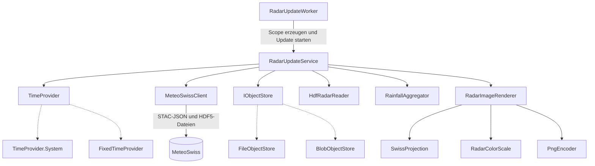
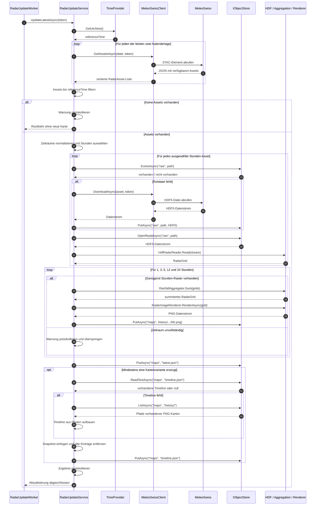

# Services: Abhängigkeiten und Aktualisierungsablauf

Diese Dokumentation beschreibt die Service-Klassen in diesem Ordner und den Ablauf von
`RadarUpdateService.UpdateLatestAsync()`.

## Service-Abhängigkeiten

`RadarUpdateWorker` ist ein ASP.NET Core `BackgroundService`. Er löst die Aktualisierung beim
Start und anschließend im konfigurierten Intervall aus. Bei gesetztem
`Radar:FixedReferenceTimeUtc` kann der Worker stattdessen genau einen reproduzierbaren Lauf
ausführen.

Die konkrete Implementierung von `IObjectStore` wird in `Program.cs` gewählt:

- Ohne `Storage:AccountUri` wird `FileObjectStore` für das lokale Dateisystem registriert.
- Mit `Storage:AccountUri` wird `BlobObjectStore` für Azure Blob Storage registriert.

`RadarImageRenderer` verwendet drei statische Hilfsklassen: `SwissProjection` rechnet
WGS84-Koordinaten in LV95 um, `RadarColorScale` ordnet den Regenwerten RGBA-Farben zu und
`PngEncoder` erzeugt daraus die PNG-Datei.

## Ablauf von `UpdateLatestAsync()`

Die Rohdaten werden unter `raw/yyyy/MM/dd/` gespeichert. Vorbereitete Karten liegen unter
`maps/history/yyyyMMddHHmm/`, während `maps/latest.json` auf den neuesten Stand und
`maps/timeline.json` auf die verfügbaren historischen Karten verweist.

## Zugehörige Dateien

- [`RadarUpdateWorker.cs`](RadarUpdateWorker.cs): Zeitsteuerung und Aufruf des Services
- [`RadarUpdateService.cs`](RadarUpdateService.cs): Orchestrierung der Aktualisierung
- [`MeteoSwissClient.cs`](MeteoSwissClient.cs): STAC-Abfrage und Download der HDF5-Dateien
- [`IObjectStore.cs`](IObjectStore.cs): Speicherabstraktion
- [`FileObjectStore.cs`](FileObjectStore.cs): Speicherung im lokalen Dateisystem
- [`BlobObjectStore.cs`](BlobObjectStore.cs): Speicherung in Azure Blob Storage
- [`HdfRadarReader.cs`](HdfRadarReader.cs): Einlesen des HDF5-Rasters
- [`RainfallAggregator.cs`](RainfallAggregator.cs): Bildung der Regensummen
- [`RadarImageRenderer.cs`](RadarImageRenderer.cs): Umwandlung eines Rasters in eine PNG-Karte
- [`RadarColorScale.cs`](RadarColorScale.cs): Farbzuordnung nach Niederschlagsmenge
- [`PngEncoder.cs`](PngEncoder.cs): Kodierung der RGBA-Pixel als PNG
- [`SwissProjection.cs`](SwissProjection.cs): Koordinatentransformation nach LV95
- [`FixedTimeProvider.cs`](FixedTimeProvider.cs): Konfigurierbare feste Referenzzeit
